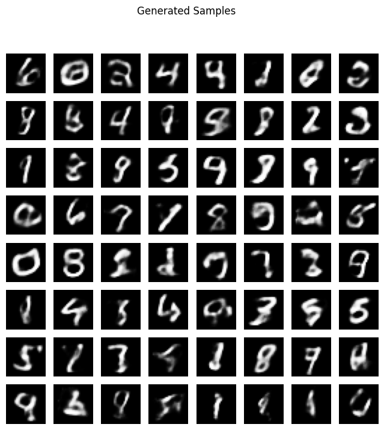
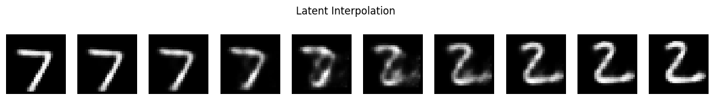

# Variational Autoencoder on MNIST (PyTorch)

An MLP-based **VAE** trained on MNIST: data pipeline, encoder producing `mu` and `logvar`, the **reparameterisation trick**, a combined reconstruction + KL-divergence loss, a logged training loop, and reconstruction / generation visualisations, with a written analysis in the notebook.

## Details
- **Data**: 60,000 train / 10,000 test MNIST digits, GPU training.
- **Architecture**: MLP encoder and decoder, **20-dimensional latent space**.
- **Loss**: binary cross-entropy reconstruction + KL divergence to a unit Gaussian.
- **Training**: 20 epochs, per-epoch logging of total, reconstruction and KL loss.

## Results
| Epoch 20 (per-sample) | Value |
|---|---|
| Total loss | 104.14 |
| Reconstruction | 78.75 |
| KL | 25.40 |

Loss decreased steadily across epochs (epoch 16 total 104.68 to epoch 20 total 104.14).

**Limitations.** An MLP VAE produces blurry reconstructions and samples, as expected for a pixel-wise likelihood; no beta-VAE, convolutional encoder or quantitative generative metric (e.g. FID) was evaluated. The notebook discusses these directions.

## Skills demonstrated
Generative modelling, variational inference (ELBO, KL), reparameterisation, PyTorch, experiment logging, visual diagnostics.

## Run
`pip install -r requirements.txt`; MNIST downloads automatically. Run the notebook top to bottom.

## Context
Built as an individual assignment for the MSc in Artificial Intelligence & Machine Learning at the University of Adelaide (Generative AI, 2025). Assignment brief text embedded in the notebook is the course's; the implementation and write-up are my own.

## Licence
MIT. See [LICENSE](LICENSE).
